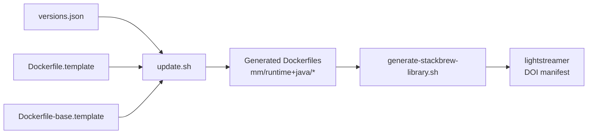

# Making changes to this repository

This document is for anyone modifying the Lightstreamer Docker images — whether you're bumping a patch version, adding a new Java runtime, or changing the Dockerfile itself. It describes the generation pipeline, gives a playbook for each common change, and — in the last section — explains how to publish the result to [Docker Official Images](https://hub.docker.com/_/lightstreamer).

## How the repository is organised

```
├── versions.json                     ← Source of truth for versions × runtimes × variants
├── Dockerfile.template               ← Template for the "full" edition
├── Dockerfile-base.template          ← Template for the "base" edition
├── update.sh                         ← Regenerates the Dockerfile tree from versions.json
├── generate-stackbrew-library.sh     ← Regenerates the `lightstreamer` manifest
├── lightstreamer                     ← DOI manifest (generated; committed for review)
│
├── <major.minor>/<runtime><java>/Dockerfile         ← generated (full edition)
├── <major.minor>/<runtime><java>-base/Dockerfile    ← generated (base edition)
│
├── test/
│   ├── lint.sh                       ← Layer 1: shellcheck, JSON schema, hadolint
│   ├── regression.sh                 ← Layer 2: no unresolved placeholders, tag consistency, golden diff
│   └── build-and-run.sh              ← Layer 3: build every image, healthcheck the full ones
│
└── docs/                             ← This file lives here
```

**Don't hand-edit files under `<major.minor>/…/Dockerfile`.** They're regenerated from `Dockerfile*.template` + `versions.json`. Any manual edit is lost the next time `./update.sh` runs.

## The generation pipeline



- **`update.sh`** iterates every `(version × runtime × java × variant)` combination in `versions.json`, feeds each through the appropriate template via `envsubst`, and writes one Dockerfile per combination.
- **`generate-stackbrew-library.sh`** walks the generated tree, looks up patch versions from `versions.json`, and emits the DOI-format `lightstreamer` file with the tag list and git commit hashes.
- **`lightstreamer`** is committed to the repo as a golden reference — the regression test compares fresh generator output against it, so any unintentional tag change surfaces in the PR diff.

## Branching and PR flow

**All changes go on a topic branch and are merged into `master` via pull request.** Never commit directly to `master`. Every PR should:

1. Be based on the current `master`.
2. Contain only related commits (small, self-contained).
3. Leave `./test/lint.sh` and `./test/regression.sh` passing.

Once merged, follow the [Publishing to Docker Official Images](#publishing-to-docker-official-images) section below to propagate the change to [`hub.docker.com/_/lightstreamer`](https://hub.docker.com/_/lightstreamer).

The playbooks below assume you have already created a topic branch:

```bash
git switch master && git pull
git switch -c <topic-branch>            # e.g. release-7.4.9, add-java-26
```

After the playbook completes, push the branch and open a PR:

```bash
git push -u origin <topic-branch>
gh pr create --base master              # or via the GitHub UI
```

## Common changes

### 1. Bump a patch version (e.g. 7.4.8 → 7.4.9)

Most frequent change. Edit exactly one line in `versions.json`:

```json
"7.4": {
    "version": "7.4.9",                     ← change this
    "runtimes": { "jdk": ["8", "11", "17", "21", "25"] }
}
```

Then regenerate and commit:

```bash
./update.sh
./generate-stackbrew-library.sh > lightstreamer
./test/lint.sh && ./test/regression.sh
git add versions.json 7.4/ lightstreamer
git commit -m "Release 7.4.9"
git push
```

### 2. Add a new Java version (e.g. Java 26 on 7.4)

Add the version to `runtimes.jdk` for the affected `major.minor`:

```json
"7.4": {
    "version": "7.4.9",
    "runtimes": { "jdk": ["8", "11", "17", "21", "25", "26"] }
}
```

Then:

```bash
./update.sh                            # creates new 7.4/jdk26[-base]/ dirs
./generate-stackbrew-library.sh > lightstreamer
./test/lint.sh && ./test/regression.sh
git add versions.json 7.4/jdk26 7.4/jdk26-base lightstreamer
git commit -m "Add Java 26 support to 7.4"
git push
```

If Java 26 should become the new canonical/default (the one that gets bare tags like `7.4`, `latest`, `7`), also update `default_java` at the top of [`generate-stackbrew-library.sh`](../generate-stackbrew-library.sh) and regenerate.

### 3. Add a new Lightstreamer major/minor (e.g. 7.5)

Add a new object under `.versions`:

```json
"7.5": {
    "version": "7.5.0",
    "runtimes": { "jdk": ["11", "17", "21", "25"] }
}
```

Then regenerate. Note:

- The **overall latest** (the version that earns `latest`/`<major>` tags) is determined by the LAST key in `.versions`. Put newer versions later.
- If it's a new major (e.g. `8.0`), the `<major>-…` tag for `8` will move to it automatically.

### 4. Modify a Dockerfile template

Edit `Dockerfile.template` (full edition) or `Dockerfile-base.template` (base edition). Then:

```bash
./update.sh                            # regenerates every Dockerfile
./generate-stackbrew-library.sh > lightstreamer   # only needed if template
                                                   # changes affect git-commit reachability
./test/lint.sh && ./test/regression.sh
./test/build-and-run.sh                # RECOMMENDED for template changes
```

The `build-and-run.sh` step is slow (10–30 min) but it's the only way to catch template bugs that only surface at `docker build` time — a broken template renders to a syntactically-fine Dockerfile that fails when Docker tries to execute it.

### 5. Change tag naming rules

Tag rules live inside the main loop of [`generate-stackbrew-library.sh`](../generate-stackbrew-library.sh) — read the inline comments there before editing.

After the change:

```bash
./generate-stackbrew-library.sh > lightstreamer
./test/regression.sh                   # will FAIL on golden diff if tags changed
```

If the change is intentional, the golden diff failure IS the sanity check — review the diff carefully, then commit the new `lightstreamer` file.

## Testing checklist

Run in order; each layer builds on the previous:

| Layer | Command | Runtime | Purpose |
|---|---|---|---|
| Static | `./test/lint.sh` | ~1s | shellcheck + JSON schema + hadolint on generated Dockerfiles |
| Regression | `./test/regression.sh` | ~1s | placeholders resolved, tag consistency, golden diff |
| Build + run | `./test/build-and-run.sh` | 10–30 min | actually builds every image; runs each full-edition variant and checks `/lightstreamer/healthcheck` |

The first two should pass on every commit. The third is optional per commit but expected before opening a PR that touches templates or the generator.

## Commit conventions

Small commits, one topic each. Suggested subject-line format:

```
Release <patch-version>                     ← for a version bump
Add <feature> to <mm>                       ← for a matrix expansion
<Component>: <what changed>                 ← for other changes
```

Every commit should leave the repo in a "tests pass" state — no "WIP; will fix in next commit". Practically: run `./test/lint.sh && ./test/regression.sh` before every commit.

## Publishing to Docker Official Images

To make these images visible on [`hub.docker.com/_/lightstreamer`](https://hub.docker.com/_/lightstreamer), submit a PR against [`docker-library/official-images`](https://github.com/docker-library/official-images) that updates `library/lightstreamer` with the freshly-generated manifest.

### One-time setup

```bash
# Fork docker-library/official-images on GitHub, then clone your fork locally:
git clone git@github.com:<your-user>/official-images.git
cd official-images
git remote add upstream https://github.com/docker-library/official-images.git
```

### PR title convention

Before running the [Workflow](#workflow) below, decide the PR title — you'll use the same short summary in both `git commit -m "…"` and `gh pr create --title "…"`. DOI expects the form `<image>: <short summary>`, ideally under ~60 characters so titles don't truncate in the GitHub UI. Keep the summary minimal; details go in the PR body.

| Change | Title |
|---|---|
| Routine patch bump | `lightstreamer: 7.4.10` |
| Add a new Java version | `lightstreamer: add jdk26` |
| Add a new major/minor | `lightstreamer: 7.5.0` |
| Structural change (tag scheme, new variant family, etc.) | `lightstreamer: refactor tag scheme; add -base variant` |

Rules of thumb:

- **State the *change*, not the motivation.** `refactor tag scheme` ✅, not `improve tag discoverability` ❌.
- **Use a semicolon for two conceptually distinct changes** in one PR. Reviewers know to check each independently.
- **Omit consequences** (dependency bumps triggered by the change, etc.) — the body explains them. Keeps the title stable if the body evolves during review.
- **Reuse DOI's own vocabulary** where it exists — "refactor tag scheme", "add variant", "add architecture", "deprecate" — so the title sets the correct reviewer mental model.

### Workflow

After your source-repo change is merged into `master` (via the [Branching and PR flow](#branching-and-pr-flow) at the top of this document), regenerate the manifest, verify locally, then open the PR against [`docker-library/official-images`](https://github.com/docker-library/official-images) from your fork:

```bash
# In the source repo (on master, fully up to date)
./generate-stackbrew-library.sh > lightstreamer
./test/lint.sh && ./test/regression.sh
bashbrew --library "$(pwd)" build lightstreamer   # optional but recommended — same build DOI's CI runs

# In the official-images fork
cd <path-to-official-images-fork>
git switch master && git fetch upstream && git reset --hard upstream/master
git push origin master --force-with-lease
git switch -c lightstreamer-<short-desc>          # e.g. lightstreamer-7.4.10
cp <path-to-source-repo>/lightstreamer library/lightstreamer
git add library/lightstreamer
git diff --staged                                 # sanity: only expected lines changed
git commit -m "lightstreamer: <short-summary>"
git push origin lightstreamer-<short-desc>

gh pr create --repo docker-library/official-images --base master \
    --title "lightstreamer: <short-summary>"
```

Notes on the surprising-looking commands:

- **`git reset --hard upstream/master` + `git push --force-with-lease` on the fork's `master`** — the fork's master serves purely as a launching pad for PR branches; it should always mirror upstream. `--force-with-lease` is a safer variant of `--force` that refuses to push if someone else has updated the remote in the meantime.
- **`bashbrew --library "$(pwd)" build lightstreamer`** — `"$(pwd)"` is the source repo. Bashbrew reads the `lightstreamer` manifest from that directory and builds every block using the exact procedure DOI's CI runs. Green here means the DOI bot will most likely be green too. Skip for trivial changes (patch bump on already-published tags); recommended for template changes, new variants, or tag-scheme rework.

### Iterating on reviewer comments

If a DOI maintainer requests changes, land the fix in the source repo the normal way (topic branch → PR → tests green → merged into `master`), then update the fork's PR branch:

```bash
# In the source repo (on master, after the follow-up change has landed)
./generate-stackbrew-library.sh > lightstreamer

# In the official-images fork
cd <path-to-official-images-fork>
git switch lightstreamer-<short-desc>
cp <path-to-source-repo>/lightstreamer library/lightstreamer
git add library/lightstreamer
git commit --amend --no-edit                      # or a new commit if you prefer
git push --force-with-lease
```

The GitHub PR auto-updates and the DOI bot re-runs its checks.

### What NOT to include in the DOI PR

- Any file other than `library/lightstreamer`. No docs, no scripts, no `.github/workflows` — those live in your source repo only.
- Whitespace-only diffs or reordered blocks. Always regenerate the manifest fresh from `generate-stackbrew-library.sh` rather than hand-editing.
- Commit hashes that aren't pushed to a public branch or tag on `github.com/Lightstreamer/Docker`.

### Edge case: dry-run from a non-`master` branch

The standard flow requires merging to `master` before submitting to DOI. For exceptional cases — say you want DOI maintainer feedback on a big refactor before merging it — `generate-stackbrew-library.sh` supports it: when run on a branch other than `master`, it automatically emits `GitFetch: refs/heads/<branch>` at the top of the manifest so DOI's `naughty.sh` check can find the referenced commits. Regenerating from `master` afterwards drops the line automatically; no cleanup needed.

## Prerequisites (host tooling)

- **bash ≥ 4** (for associative arrays, `${arr[-1]}`)
- **jq ≥ 1.6**
- **docker** (for `test/build-and-run.sh` only)
- **shellcheck** (recommended)
- **hadolint** (recommended)
- **envsubst** (part of gettext, usually preinstalled)
- **curl** (for `test/build-and-run.sh`'s healthcheck probe)

On Debian/Ubuntu:

```bash
sudo apt-get install -y jq shellcheck gettext-base curl
sudo wget -O /usr/local/bin/hadolint \
    https://github.com/hadolint/hadolint/releases/latest/download/hadolint-Linux-x86_64
sudo chmod +x /usr/local/bin/hadolint
```

## Getting help

The two generator scripts ([`update.sh`](../update.sh), [`generate-stackbrew-library.sh`](../generate-stackbrew-library.sh)) are heavily commented — read them alongside this document if a playbook step feels underspecified.

If something's unclear or a common change isn't covered here, open an issue.
